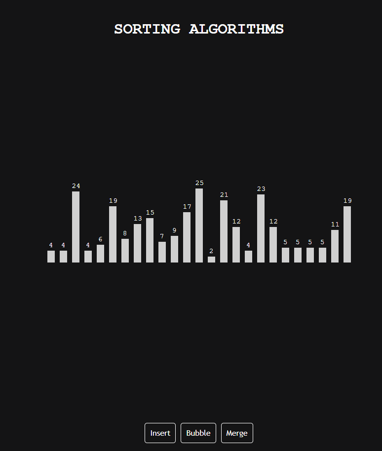

# Sorting Algorithm Visualization

A Sorting Algorithm Visualization website, where you can interactively explore and visualize various sorting algorithms.

<p align="center">
  <a href="https://sorts.pages.dev/">
    
  </a>
</p>


## Features

- Visualize popular sorting algorithms in action.
- Play sounds as elements move to enhance the experience.
- Adjust the speed of the visualizations.
- Observe the algorithm's progress in real-time.
- Learn and compare different sorting algorithms.

## Live Demo

You can explore the Sorting Algorithm Visualization website live at [https://sorts.pages.dev/](https://sorts.pages.dev/).

## Supported Sorting Algorithms

Currently, the website supports the following sorting algorithms:

- Bubble Sort
- Insertion Sort

## Getting Started

1. Clone the repository to your local machine:

   ```bash
   git clone https://github.com/yourusername/sorting-algorithm-visualization.git
