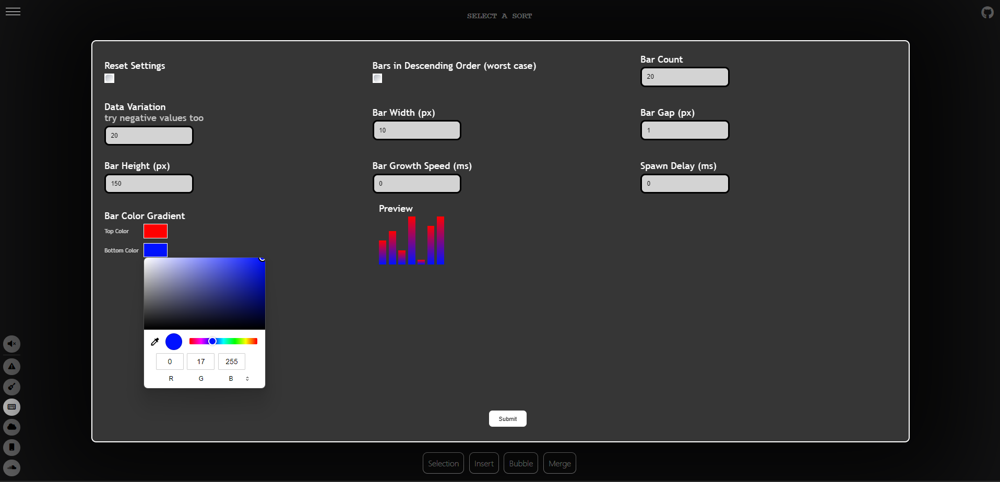

# Sorting Algorithm Visualization

A Sorting Algorithm Visualization website, where you can interactively explore and visualize various sorting algorithms. (click the image)

<p align="center">
  <a href="https://sorts.pages.dev/" target="_blank">
    
  </a>
</p>


## Features

- Worst Case Generation
- Bar Count 
- Bar Value Variation (can be negative which reverses sorting direction)
- Bar Width 
- Bar Height
- Bar Gap
- Bar Growth Speed: rate in ms that a bar takes to grow height from 0 to its value
- Bar Spawn Delay: rate in ms for each bar to spawn when generating random data
- Bar Color Gradient
- Sound Effects on Every Data Shift

<p align="center">
  <a href="https://sorts.pages.dev/" target="_blank">
    
    
  </a>
</p>

## Live Demo

You can explore the Sorting Algorithm Visualization website live at [https://sorts.pages.dev/](https://sorts.pages.dev/).

## Supported Sorting Algorithms

Currently, the website supports the following sorting algorithms:

- Bubble Sort
- Insertion Sort
- Selection Sort
- Merge Sort

## Getting Started

1. Clone the repository to your local machine:

   ```bash
   git clone https://github.com/yourusername/sorting-algorithm-visualization.git
